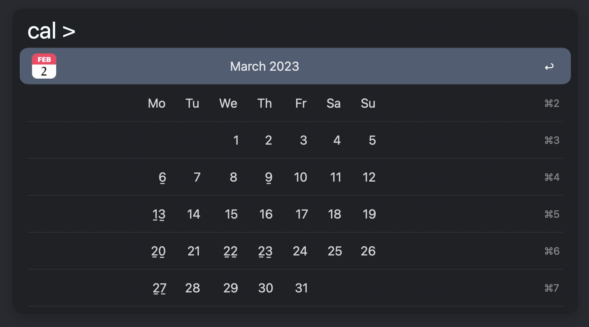
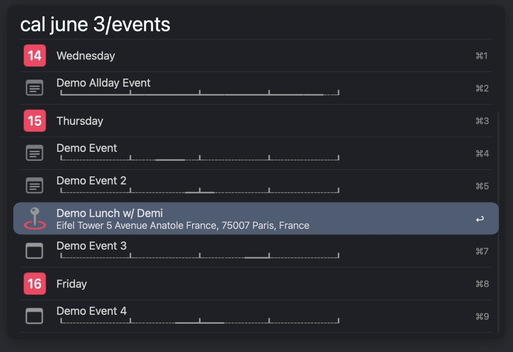
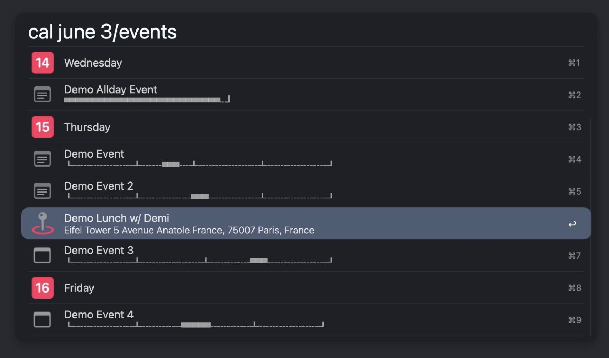
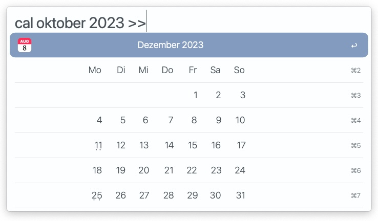
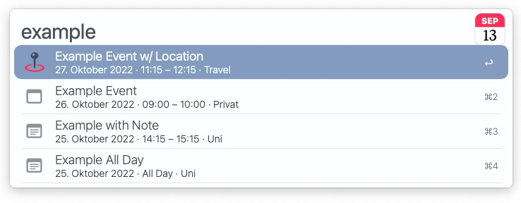
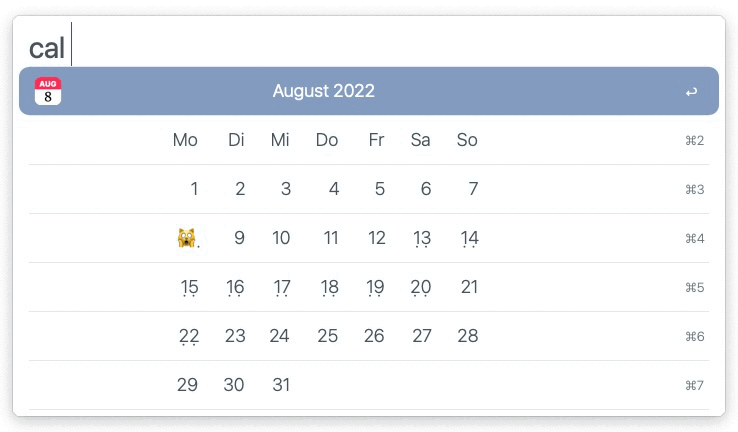

<h1 align="center"> Alfred Calendar++</h1>

	

A calendar workflow that integrates your Apple Calendar events. Navigate the months by typing ` > ` to move forward or ` < ` to move backward. Enter the name of a month in natural language to jump to that month. Enter a valid year to jump to the active month of that year. 

<!---->

**Use**   ` cal [ month ] [ year ] [ < ] [ > ] `  
**Example**		` cal october 2023 >> `

Make sure you set the correct font and size in the workflow configuration to get accurate rendering. To test different settings you can clear the cache with the keyword `calreset`. 

<!--  -->

## Feature Overview

- Generated icon for the current day
- Adaptive to the windows width
- Preview all events of the selected week
	- Show event in Apple Calendar
	- Show week in Apple Calendar
- Location preview with Apple Maps (⇧)
- Open location with Google Maps (⌘⏎)
- Configurable character representing today
- Configurable spacing
- Configurable font (*required unless a default theme is detected*)
- Configurable locale
- Configurable first day of the week
- (Optional) Mark the days that have events
- (Optional) Show the count of events in a week (⌘)
- (Optional) Timeline - Graphically render the events relative position in a day
- (Optional) Retrieve `ics` for quicklook preview (⇧)
- Several customizations (See the workflow configuration)
- Search your events (Default Keyword: `cals`)

## Calendar Search

**Use** 			` cals [ query ] `  
**Exampe** 	` cals example `

