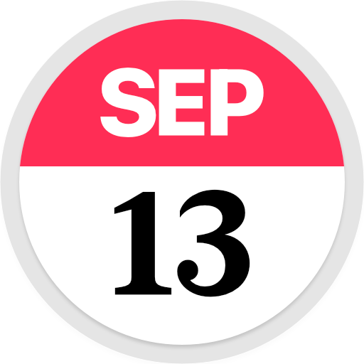

<h1 align="center"> Alfred Calendar++</h1>

	

A feature-rich block calendar workflow with Apple Calendar integration to __view__, __create__, and __search__ calendar events, or to check your upcoming __agenda__.

## Setup

1. Install the [SF Pro font](https://developer.apple.com/fonts/) from Apple to see the icons
2. Ensure Alfred has [permission](https://www.alfredapp.com/help/getting-started/permissions/) to access calendar events[^1]
3. Ensure you are not using an Alfred default theme

## How to Use

Activate the workflow with the keyword (default: `cc`) or by using the [Hotkey](https://www.alfredapp.com/help/workflows/triggers/hotkey/). 
Quick access keywords for the __agenda__, creating __new events__, and the global __search__ are derived from the keyword by appending __a__, __n__, or __s__: `cca`, `ccn`, `ccs`.

### Block Calendar

1. __Type__
+ the name of a month or year to jump to that month or year[^2]
+ `<` or `>` to step through the months
+ `!` to see available *!bang* expansions
+ `?` to see the internal configuration
2. __Week Row__
+ <kbd>↩</kbd> to open a selected week in the Calendar app if no events are found
+ <kbd>↩</kbd> to open the __week view__ listing available events of a selected week
+ <kbd>⌘</kbd> to view the number of events scheduled for a selected week
+ <kbd>⌘</kbd><kbd>↩</kbd> to open a selected week in the Calendar app

### Week View

1. __Type__ to filter events based on your query
2. __On Weekdays__
+ <kbd>↩</kbd> to open the selected weekday in the Calendar app
3. __On Calendar Events__
+ <kbd>↩</kbd> to open the selected event in the Calendar app
+ <kbd>⌃</kbd> to view the exact time of the event or the timeline representation
+ <kbd>⌥</kbd><kbd>↩</kbd> to open a location in Google Maps or join a video call
+ <kbd>⌘</kbd><kbd>↩</kbd> to create a new event after the selected event
+ <kbd>fn</kbd><kbd>↩</kbd> to open a URL associated with the selected event
+ <kbd>⌘</kbd><kbd>L</kbd> to view the digest of a calendar event's info as [Large Type](https://www.alfredapp.com/help/features/large-type)
+ <kbd>⌘</kbd><kbd>Y</kbd> (or tap <kbd>⇧</kbd>) to Quick Look preview a location on Apple Maps or a URL associated with the event

### Agenda

Quick access keyword: `cca`

1. __Type__ to filter upcoming events based on your query
2. __On Calendar Events__
+ <kbd>↩</kbd> to open the selected event in the Calendar app
+ <kbd>⌃</kbd> to view the exact time of the event
+ <kbd>⌥</kbd><kbd>↩</kbd> to open a location in Google Maps or join a video call
+ <kbd>⌘</kbd><kbd>↩</kbd> to create a new event after the selected event
+ <kbd>fn</kbd><kbd>↩</kbd> to open a URL associated with the selected event
+ <kbd>⌘</kbd><kbd>L</kbd> to view the digest of a calendar event's info as [Large Type](https://www.alfredapp.com/help/features/large-type)
+ <kbd>⌘</kbd><kbd>Y</kbd> (or tap <kbd>⇧</kbd>) to Quick Look preview a location on Apple Maps or a URL associated with the event

### New Event

Quick access keyword: `ccn`

 

1. __Type__ to specify the new event.
+ `<` or `>` to modify the day
+ `+` or `-` to modify the time[^3]
+ `(note)` to add a note
+ `(@location)` to add a location
+ `(=calendar)` to specify a calendar
+ `(!title)` to ensure that some text is registered only as title 
+ `!allday` to create an all day event
+ `https://example.com` to add a URL to the event
2. <kbd>⌥</kbd> to view the cheat sheet
3. <kbd>⌘</kbd><kbd>L</kbd> to view the info of the new calendar event as [Large Type](https://www.alfredapp.com/help/features/large-type)

> [!NOTE] 
> Date information is automatically parsed from natural language

### Search Mask

Quick access keyword: `ccs`

__Type__ to find events based on your query. 

> [!NOTE] 
> The target time frame is one year: Half a year in the past, half a year in the future.

## Symbol Key

-  The event has a URL or the note contains URLs
-  The event has a note
-  The event has attendees
-  The event has a location
-  The event is a recurring event
-  An online meeting is associated with the event

## Acknowledgements

- [SwiftyChrono](https://github.com/malcommac/SwiftyChrono) for natural language date parsing

[^1]: If the access problem persists, try dragging the `calpp` executable into the list of apps with access (see [#2](https://github.com/zeitlings/alfred-calendar/issues/2#issuecomment-2132736512)).  
[^2]: For example, `cc jan 2025 <<<` reveals the block calendar for October 2024.
[^3]: Only `+` and `-` symbols at the very beginning or end will be considered to ensure their normal use everywhere else.

<!-- 
## Feature Overview

- Generated icon for the current day
- Adaptive to the windows width
- Preview all events of the selected week
	- Show event in Apple Calendar
	- Show week in Apple Calendar
- Location preview with Apple Maps (⇧)
- Open location with Google Maps (⌘⏎)
- Configurable character representing today
- Configurable spacing
- Configurable font (*required unless a default theme is detected*)
- Configurable locale
- Configurable first day of the week
- (Optional) Mark the days that have events
- (Optional) Show the count of events in a week (⌘)
- (Optional) Timeline - Graphically render the events relative position in a day
- (Optional) Retrieve `ics` for quicklook preview (⇧)
- Several customizations (See the workflow configuration)
- Search your events (Default Keyword: `cals`)
-->
